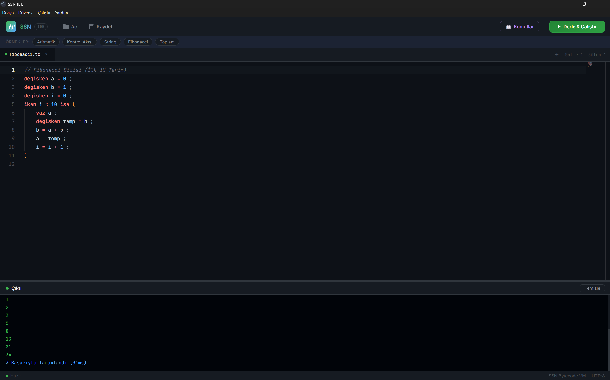
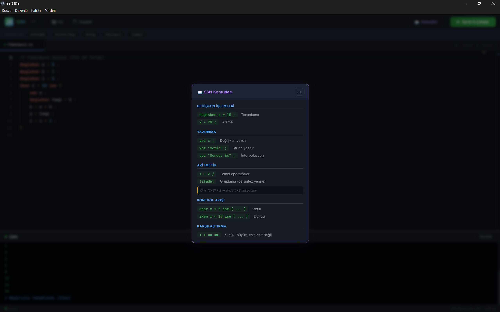

# SSN Compiler

**English** | [Türkçe](README.tr.md)

[](https://github.com/SelamiKalay/SSN-Derleyici/actions/workflows/ci.yml)



SSN is a programming language with Turkish syntax, together with its compiler.
Source code is first compiled to bytecode and then executed on a stack-based
virtual machine. The compiler is written from scratch in C++17 with no external
libraries.

```
Source → Lexer → Parser → AST → Compiler → Bytecode → VM
```

## Example

```
// Fibonacci sequence (first 10 terms)
degisken a = 0 ;
degisken b = 1 ;
degisken i = 0 ;
iken i < 10 ise (
    yaz a ;
    degisken temp = b ;
    b = a + b ;
    a = temp ;
    i = i + 1 ;
)

degisken x = !5 + 3! * 2 ;
yaz "Sonuc: &x" ;
```

## Language Features

<p align="center"></p>

| Construct | Syntax | Meaning |
|---|---|---|
| Variable declaration | `degisken x = 5 ;` | *değişken* = variable |
| Assignment | `x = x + 1 ;` | |
| Print | `yaz x ;` | *yaz* = write |
| Conditional | `eger x > 10 ise ( ... )` | *eğer … ise* = if … then |
| Loop | `iken i < 5 ise ( ... )` | *iken* = while |
| Grouping (instead of parentheses) | `!5 + 3! * 2` | |
| String interpolation | `"Merhaba &isim"` | |
| Statement terminator | `;` or `é` | |
| Comment | `// until end of line` | |

- Arithmetic: `+ - * /` (with operator precedence)
- Comparison: `< > == !=`
- Data types: number (floating point) and string

## Compiler Stages

- **Lexer** (`src/lexer.cpp`) — tokenizes keywords, numbers, strings, `&variable`
  interpolation and the UTF-8 `é` character
- **Parser** (`src/parser.cpp`) — recursive-descent parser producing an AST, with
  line-numbered error messages
- **Compiler** (`src/compiler.cpp`) — generates bytecode from the AST (conditional
  and unconditional jumps, string concatenation)
- **VM** (`src/vm.cpp`) — stack-based virtual machine with 18 opcodes
- `--debug` mode: prints the token list and a bytecode disassembly

## IDEs

- **desktop-ide/** — desktop IDE built with Electron + Monaco Editor (syntax
  highlighting, autocompletion, built-in examples, compile & run with `Ctrl+Enter`)
- **web-ide/** — browser-based IDE with a Node.js/Express backend (started with
  `SSN_IDE.bat`; a single-file version of the compiler lives in `web-ide/compiler.cpp`)

## Building and Running

Compiler (requires CMake and a C++17 compiler):

```bash
cmake -B build -DCMAKE_BUILD_TYPE=Release
cmake --build build --config Release
```

```bash
ssn program.tc                  # runs the program
ssn --debug program.tc          # also prints tokens and bytecode
```

Desktop IDE (the compiled `compiler.exe` must be placed in `desktop-ide/`):

```bash
cd desktop-ide
npm install
npm start
```

## Tests

The output of every `.tc` program under `tests/ornekler/` is compared with the
`.out` file next to it; programs under `tests/hatali/` are expected to fail with an
error. On every push, GitHub Actions runs the tests against both the main compiler
and the web IDE compiler.

```bash
bash tests/run_tests.sh build/ssn
```

## Tech Stack

C++17 · CMake · Electron · Monaco Editor · Node.js / Express
